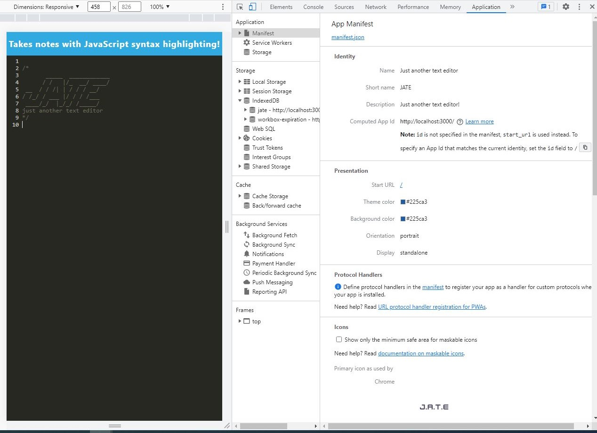
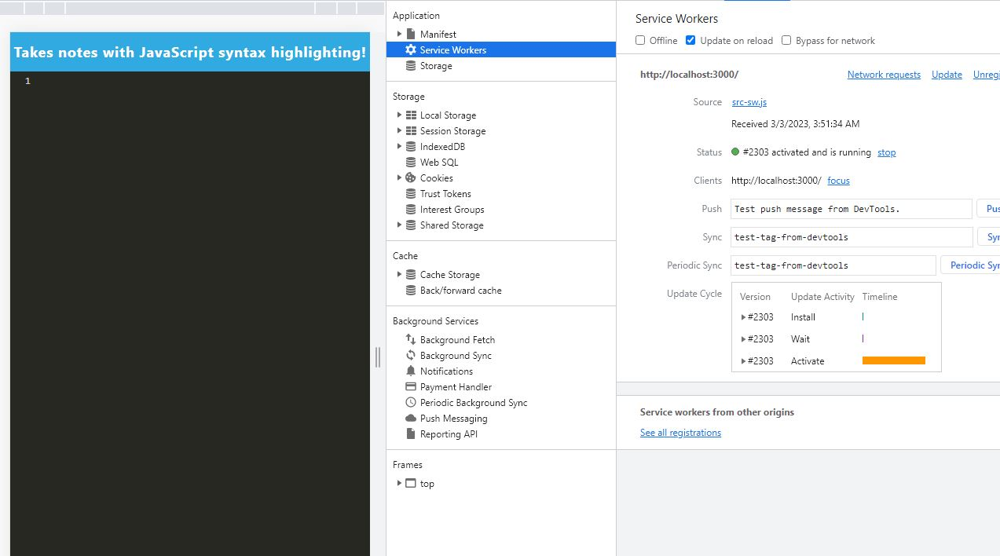
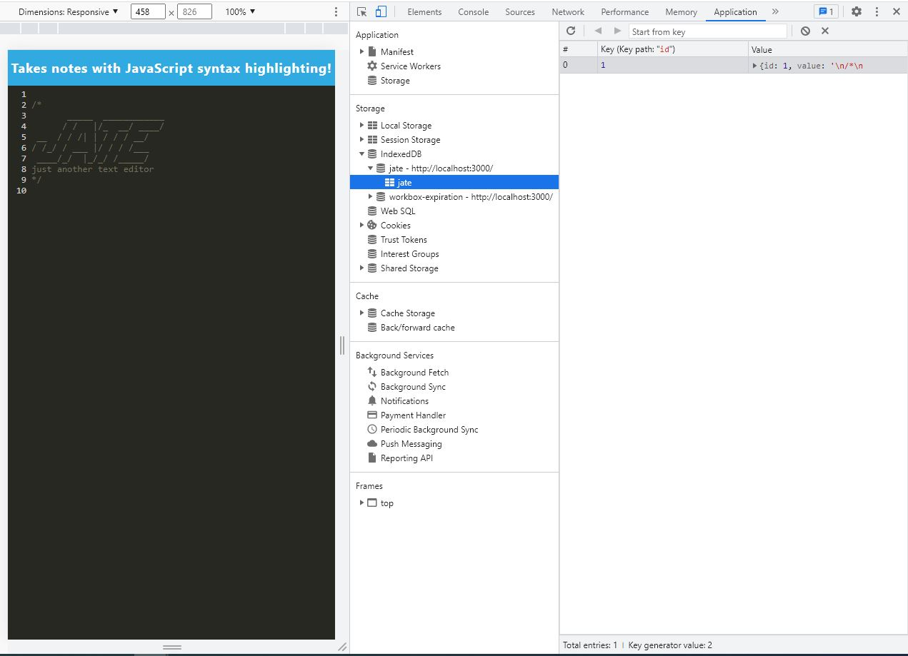

# Text-Editor-19

Text-Editor

This is my text editor that you can use in the browser

## Description

This is my text editor that you can use in the browser

## Table of Contents 

- [Installation](#installation)
- [Usage](#usage)
- [App Screenshot](#app-screenshot)
- [Technologies used](#technologies-used)
- [License](#license)
- [Contribute](#contribute)
- [Live Link](#live-link)
- [Questions](#questions)

## Installation

The user only needs to clone the repository and perform `npm install` to get all the necessary dependencies for the project. All required dependencies are included in this package, so it may be installed without worrying about missing pieces.
Next, run `npm start` to start the application.
Go to the url of the application (http//:localhost:3000) to start using it.

## Usage

Use the live link below to open the deployed application. 

https://pwa-based-text-editor.herokuapp.com/

Write in a little of code or some notes in the editor. Its contents will be saved to the IndexedDB. After being closed, the text editor saves its contents to an IndexedDB database, which can then be retrieved the next time the editor is opened. After selecting the Install button, a shortcut to the web app will be added to the desktop.
An active internet connection is not required to use the program.

## App Screenshot

##  Technologies used

Node.js, Express.js, IndexedDB, PWA, Heroku

## License

To view the project's license details, please click the license badge at the top of the ReadME.

## Live Link

https://pwa-based-text-editor.herokuapp.com/

## Contribute

Ideas that will make this application more robust can be channelled to me via [mail.](mailto:naser421@gmail.com)

## Questions

If incase of an query feel free to [mail](mailto:naser421@gmail.com) me or reach out on [GitHub](https://www.github.com/naser421).